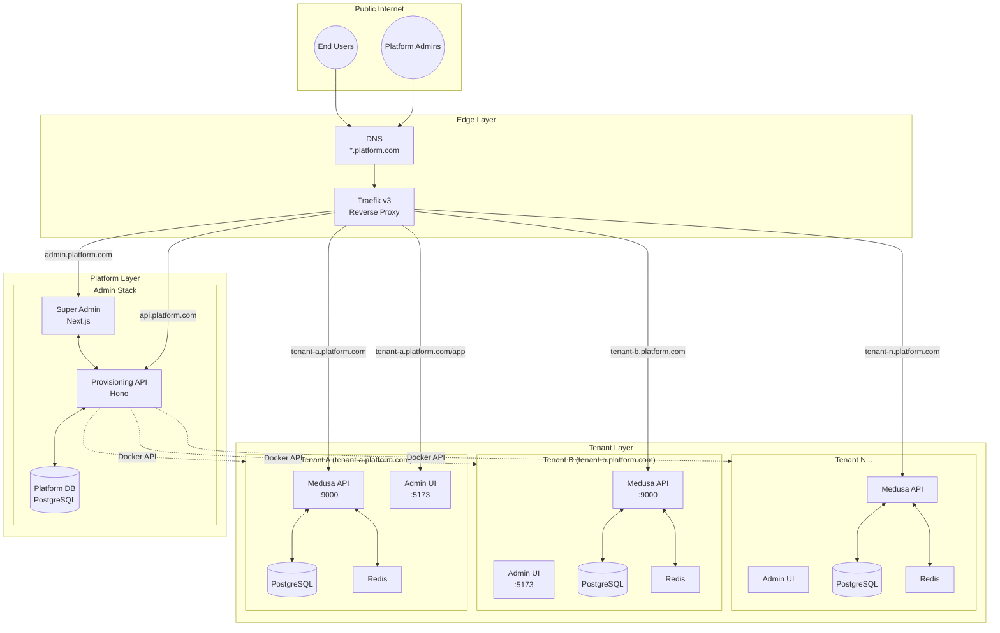
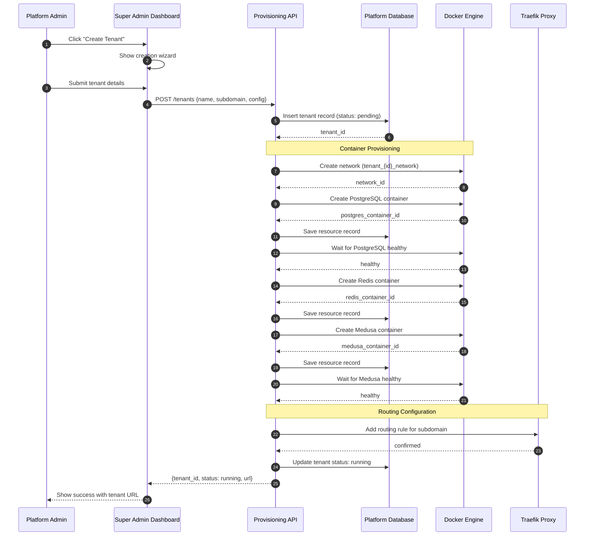
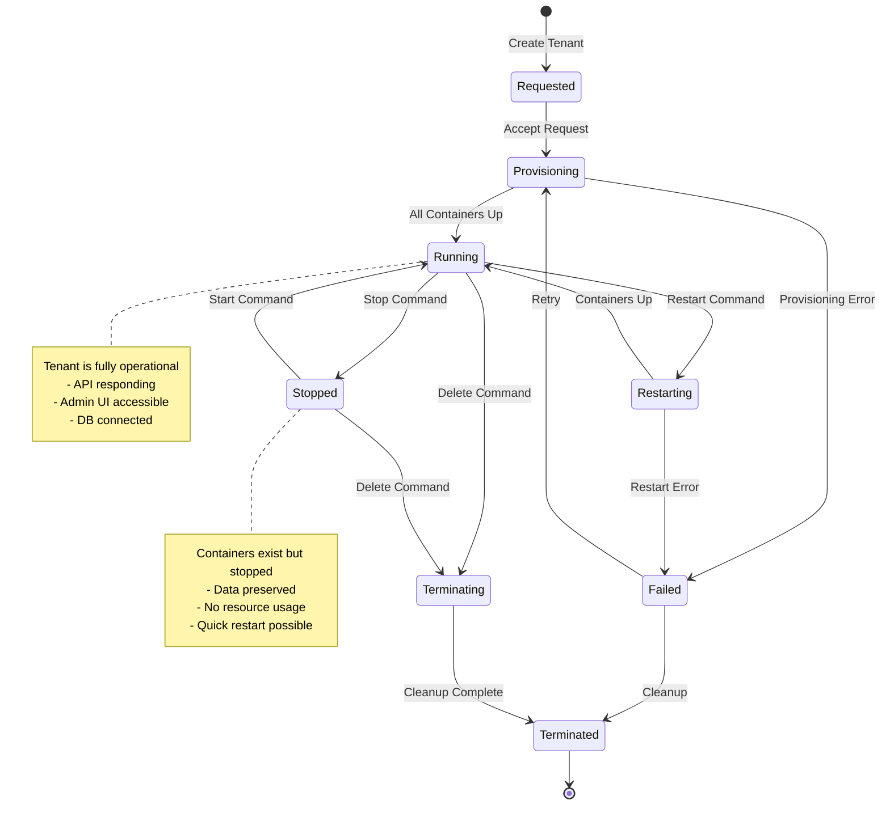
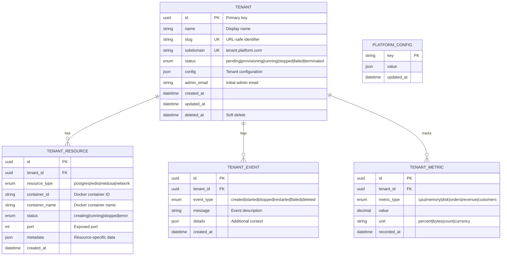
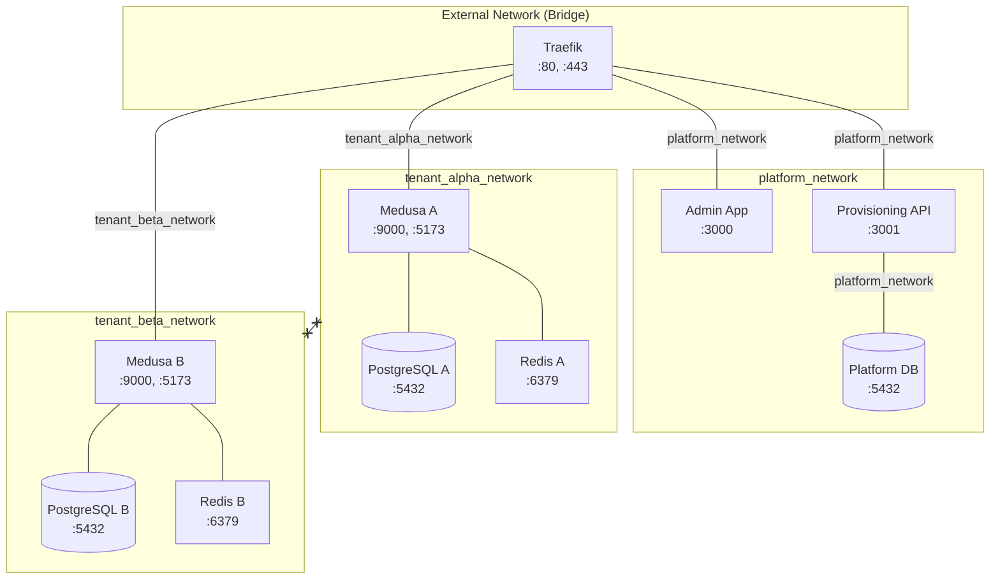
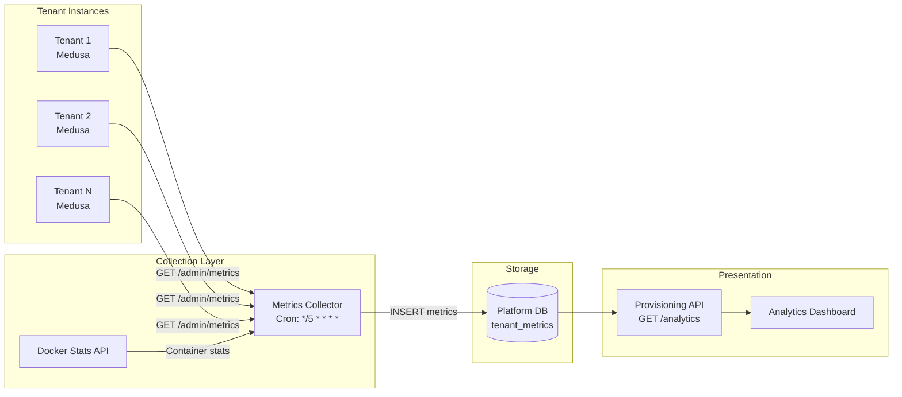
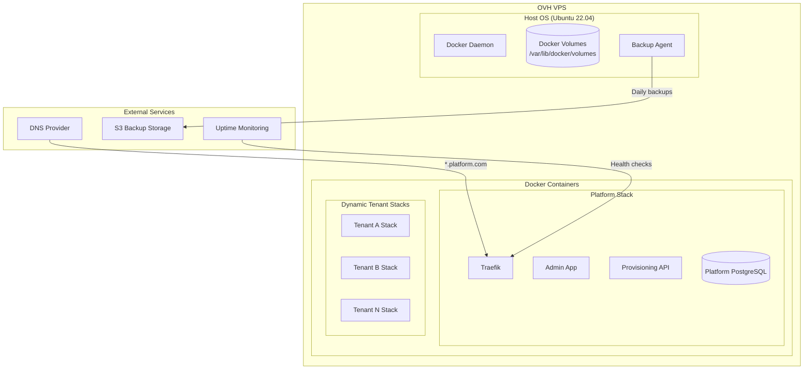
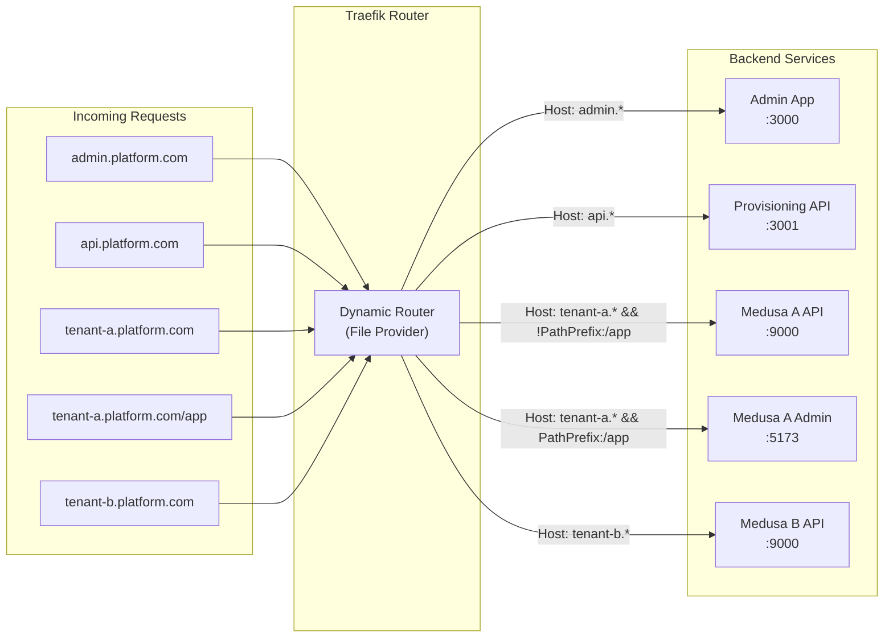
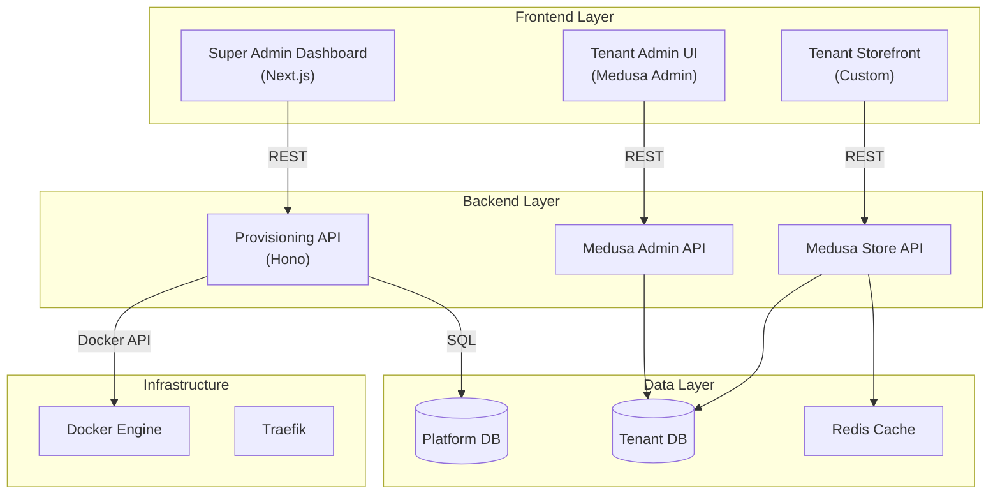

# Multi-Tenant Platform Architecture Diagrams

## System Overview

---

## Tenant Provisioning Flow

---

## Tenant Lifecycle States

---

## Data Model

---

## Network Isolation

> **Note:** Tenant networks are isolated from each other. Only Traefik has access to route traffic into each tenant network.

---

## Metrics Collection Architecture

### Collected Metrics

| Source | Metric | Frequency |
|--------|--------|-----------|
| Docker Stats | CPU % | 5 min |
| Docker Stats | Memory MB | 5 min |
| Docker Stats | Network I/O | 5 min |
| Medusa API | Order count | 5 min |
| Medusa API | Revenue | 5 min |
| Medusa API | Customer count | 5 min |
| Medusa API | Product count | 5 min |

---

## Deployment Architecture (OVH VPS)

---

## Request Routing (Traefik)

---

## Component Communication

---

*These diagrams can be rendered using any Mermaid-compatible viewer (GitHub, VS Code with Mermaid extension, etc.)*
