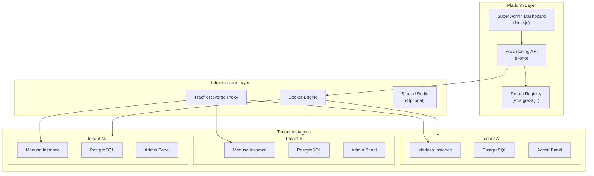
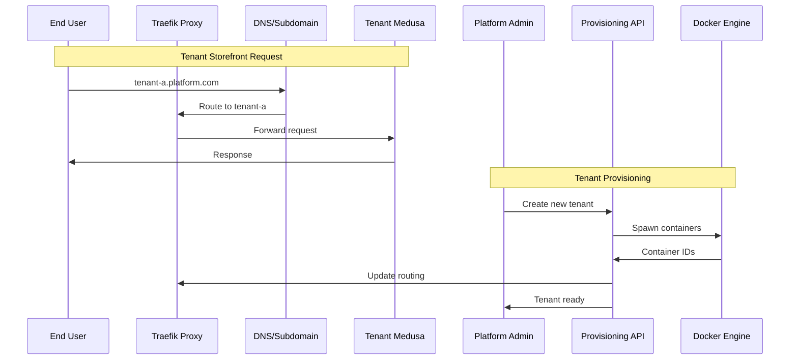
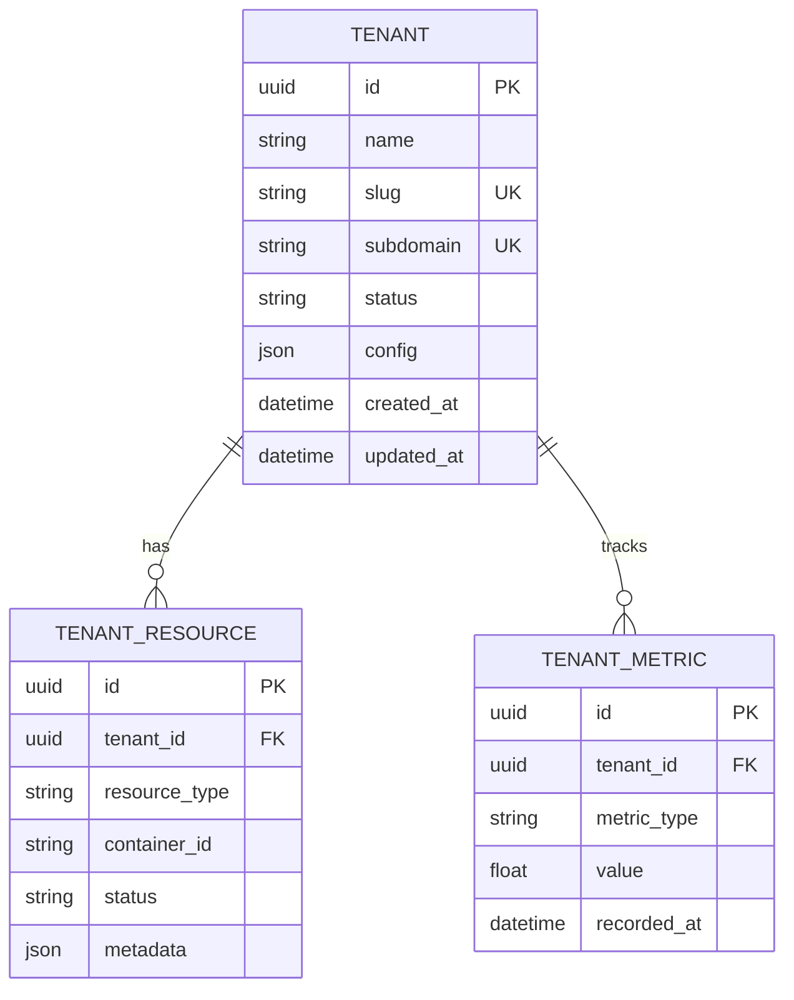
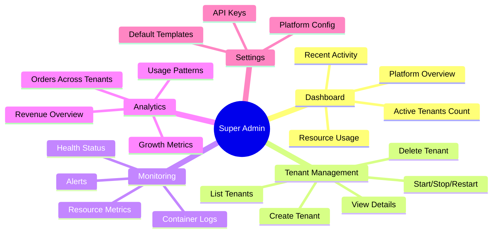
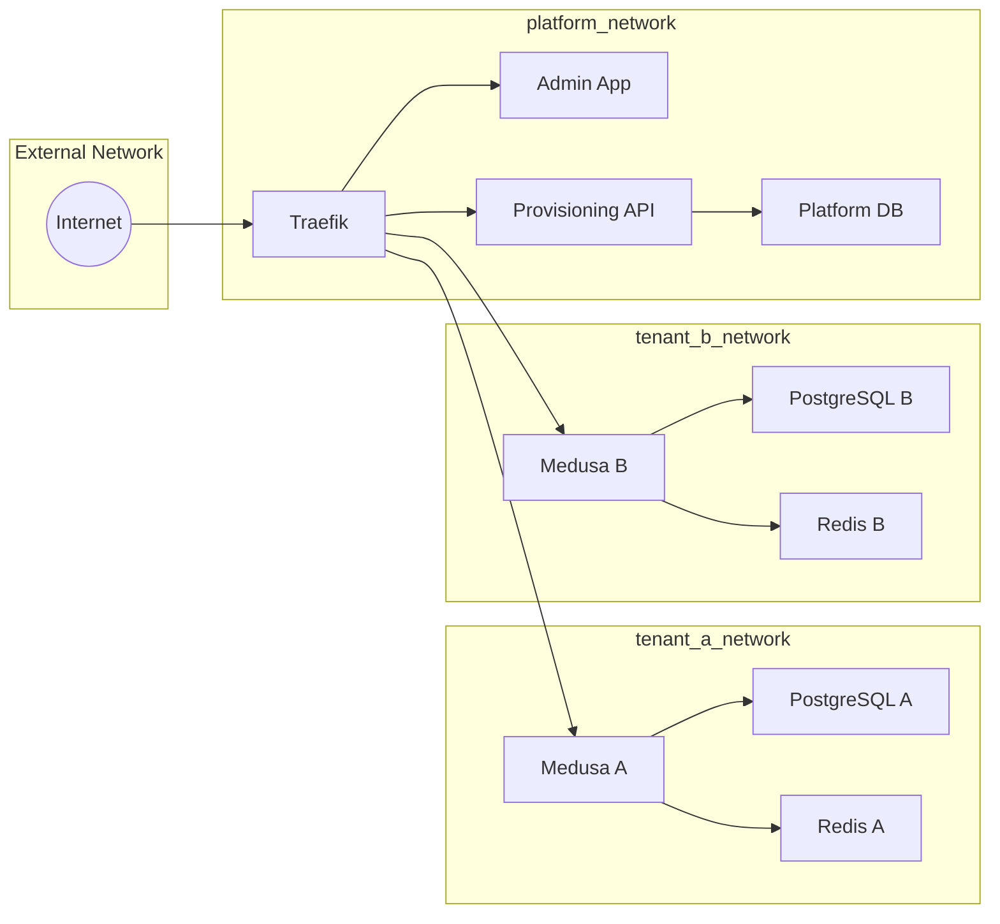
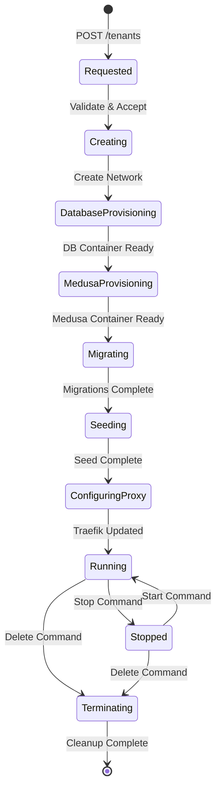
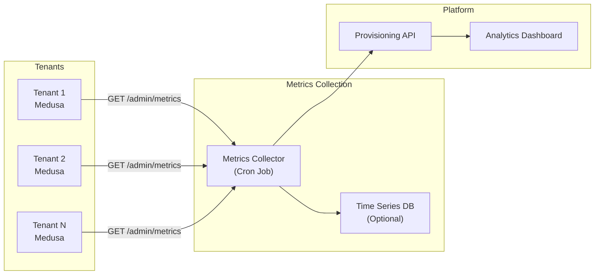
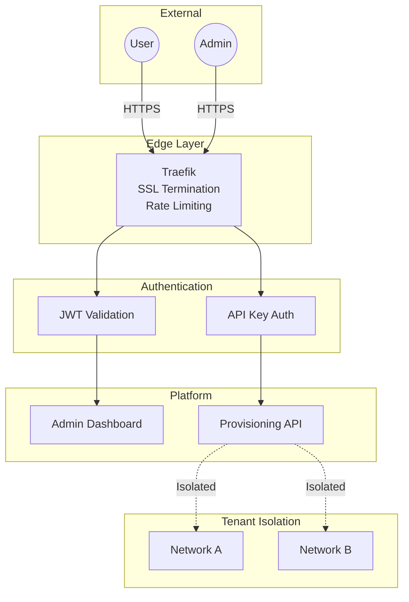
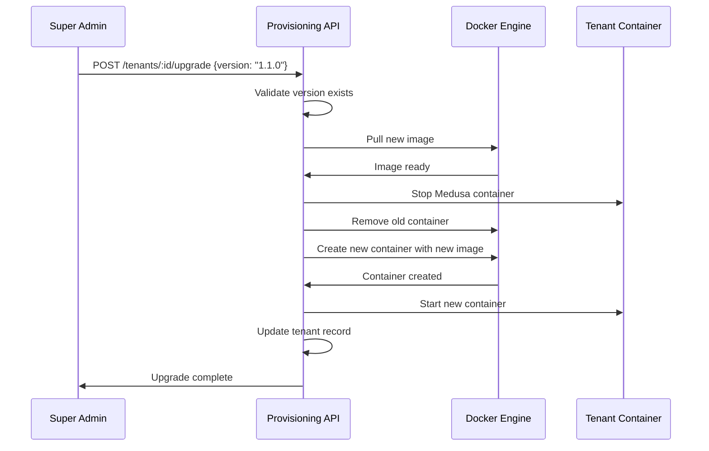

# Multi-Tenant Medusa Platform - Implementation Plan

## Executive Summary

This document outlines the implementation plan for building a multi-tenant ecommerce platform using Medusa v2. The platform will enable hosting many independent tenants, each with their own isolated Medusa instance, database, and admin panel, while providing a centralized super admin dashboard for platform management.

---

## Architecture Overview

### High-Level Architecture



### Request Flow



---

## Component Breakdown

### 1. Provisioning API (Hono) - `/apps/api/`

The core orchestration layer responsible for tenant lifecycle management.

#### Responsibilities
- Tenant CRUD operations
- Docker container orchestration
- Database provisioning
- Health monitoring
- Metrics aggregation

#### API Endpoints

| Method | Endpoint | Description |
|--------|----------|-------------|
| `GET` | `/tenants` | List all tenants with status |
| `GET` | `/tenants/:id` | Get tenant details |
| `POST` | `/tenants` | Create new tenant |
| `PATCH` | `/tenants/:id` | Update tenant config |
| `DELETE` | `/tenants/:id` | Decommission tenant |
| `POST` | `/tenants/:id/start` | Start tenant containers |
| `POST` | `/tenants/:id/stop` | Stop tenant containers |
| `POST` | `/tenants/:id/restart` | Restart tenant |
| `GET` | `/tenants/:id/logs` | Stream container logs |
| `GET` | `/tenants/:id/metrics` | Get resource metrics |
| `GET` | `/health` | Platform health check |
| `GET` | `/analytics` | Cross-tenant analytics |

#### Data Model



### 2. Super Admin Dashboard (Next.js) - `/apps/admin/`

Central management interface for platform operators.

#### Features



#### Page Structure

```
/apps/admin/src/app/
├── (dashboard)/
│   ├── page.tsx                 # Dashboard overview
│   ├── tenants/
│   │   ├── page.tsx            # Tenant list
│   │   ├── new/page.tsx        # Create tenant form
│   │   └── [id]/
│   │       ├── page.tsx        # Tenant details
│   │       ├── logs/page.tsx   # Container logs
│   │       └── metrics/page.tsx # Resource metrics
│   ├── analytics/
│   │   └── page.tsx            # Cross-tenant analytics
│   └── settings/
│       └── page.tsx            # Platform settings
├── api/                         # API routes (if needed)
├── layout.tsx
└── globals.css
```

### 3. Tenant Instance Template - `/apps/store/`

Base Medusa configuration that gets cloned for each tenant.

#### Per-Tenant Resources

Each tenant receives:
- **Medusa container** - API server (port 9000)
- **Admin UI** - Dashboard (port 5173)
- **PostgreSQL container** - Dedicated database
- **Redis** - Shared or dedicated cache

### 4. Infrastructure Components

#### Traefik Configuration

Dynamic routing based on subdomain:
- `tenant-a.platform.com` → Tenant A's Medusa
- `tenant-b.platform.com` → Tenant B's Medusa
- `admin.platform.com` → Super Admin Dashboard
- `api.platform.com` → Provisioning API

#### Docker Network Architecture



---

## Implementation Phases

### Phase 1: Foundation (Week 1-2)

#### Goals
- Set up platform database schema
- Implement basic provisioning API
- Configure Traefik reverse proxy

#### Tasks

| Task | App | Priority |
|------|-----|----------|
| Create platform database schema (tenants, resources, metrics) | `api` | High |
| Set up Drizzle ORM with PostgreSQL | `api` | High |
| Implement tenant CRUD endpoints | `api` | High |
| Add Traefik to docker-compose | `root` | High |
| Configure dynamic routing rules | `root` | High |
| Create tenant Docker template | `store` | Medium |
| API authentication (API keys) | `api` | Medium |

#### Deliverables
- Working `/tenants` API endpoints
- Traefik routing tenant subdomains
- Platform database with tenant registry

---

### Phase 2: Container Orchestration (Week 3-4)

#### Goals
- Automate tenant container lifecycle
- Implement health monitoring
- Add log streaming

#### Tasks

| Task | App | Priority |
|------|-----|----------|
| Integrate Dockerode for container management | `api` | High |
| Implement `POST /tenants` - spawn containers | `api` | High |
| Implement `DELETE /tenants/:id` - cleanup | `api` | High |
| Add start/stop/restart endpoints | `api` | High |
| Implement health checks polling | `api` | Medium |
| Add container log streaming | `api` | Medium |
| Create tenant network isolation | `api` | Medium |

#### Container Provisioning Flow



#### Deliverables
- Automated tenant provisioning
- Container lifecycle management
- Health status monitoring
- Log access via API

---

### Phase 3: Super Admin Dashboard (Week 5-6)

#### Goals
- Build tenant management UI
- Add monitoring dashboards
- Implement real-time updates

#### Tasks

| Task | App | Priority |
|------|-----|----------|
| Set up UI component library (shadcn/ui) | `admin` | High |
| Create dashboard layout & navigation | `admin` | High |
| Build tenant list page with status indicators | `admin` | High |
| Build tenant creation wizard | `admin` | High |
| Build tenant detail page | `admin` | High |
| Add start/stop/restart controls | `admin` | Medium |
| Implement log viewer component | `admin` | Medium |
| Add metrics charts (CPU, memory, requests) | `admin` | Medium |
| Real-time status updates (WebSocket/SSE) | `admin` | Low |

#### UI Wireframes

```
┌─────────────────────────────────────────────────────────────┐
│  ECONOME PLATFORM                          [Admin] [Logout] │
├─────────────┬───────────────────────────────────────────────┤
│             │                                               │
│  Dashboard  │  Tenants Overview                             │
│             │  ┌─────────────────────────────────────────┐  │
│  Tenants    │  │ Active: 12  │ Stopped: 2  │ Error: 1   │  │
│             │  └─────────────────────────────────────────┘  │
│  Analytics  │                                               │
│             │  ┌─────────────────────────────────────────┐  │
│  Settings   │  │ Search tenants...           [+ New]    │  │
│             │  ├─────────────────────────────────────────┤  │
│             │  │ ● tenant-alpha    Running    [Actions] │  │
│             │  │ ● tenant-beta     Running    [Actions] │  │
│             │  │ ○ tenant-gamma    Stopped    [Actions] │  │
│             │  │ ✖ tenant-delta    Error      [Actions] │  │
│             │  └─────────────────────────────────────────┘  │
│             │                                               │
└─────────────┴───────────────────────────────────────────────┘
```

#### Deliverables
- Functional super admin dashboard
- Tenant CRUD via UI
- Basic monitoring views

---

### Phase 4: Cross-Tenant Analytics (Week 7-8)

#### Goals
- Aggregate metrics from all tenants
- Build analytics dashboard
- Implement reporting

#### Tasks

| Task | App | Priority |
|------|-----|----------|
| Design metrics collection strategy | `api` | High |
| Create Medusa plugin for metrics export | `store` | High |
| Build metrics aggregation endpoint | `api` | High |
| Create analytics dashboard page | `admin` | High |
| Add time-series charts | `admin` | Medium |
| Implement export functionality | `admin` | Low |

#### Metrics Architecture



#### Key Metrics

| Category | Metrics |
|----------|---------|
| Orders | Total orders, revenue, avg order value |
| Products | Total products, low stock alerts |
| Customers | Total customers, new signups |
| Performance | Response time, error rate |
| Resources | CPU usage, memory, storage |

#### Deliverables
- Metrics collection from tenants
- Aggregated analytics API
- Visual analytics dashboard

---

### Phase 5: Production Hardening (Week 9-10)

#### Goals
- Security hardening
- Performance optimization
- Operational tooling

#### Tasks

| Task | App | Priority |
|------|-----|----------|
| Implement proper authentication (JWT) | `api`, `admin` | High |
| Add rate limiting | `api` | High |
| Set up SSL/TLS via Traefik | `root` | High |
| Resource limits for tenant containers | `api` | High |
| Automated backups for tenant DBs | `api` | Medium |
| Alerting for tenant failures | `api` | Medium |
| API documentation (OpenAPI) | `api` | Medium |
| Load testing | `all` | Low |

#### Security Architecture



#### Deliverables
- Secure authentication
- SSL certificates
- Resource isolation
- Backup procedures

---

## Technical Stack Summary

| Component | Technology | Purpose |
|-----------|------------|---------|
| Super Admin | Next.js 16, React 19, Tailwind CSS | Platform management UI |
| Provisioning API | Hono, Drizzle ORM, Dockerode | Tenant orchestration |
| Tenant Backend | Medusa v2 | Ecommerce functionality |
| Reverse Proxy | Traefik v3 | Dynamic routing, SSL |
| Platform DB | PostgreSQL 15 | Tenant registry |
| Tenant DBs | PostgreSQL 15 | Per-tenant data |
| Cache | Redis | Session & query cache |
| Container Runtime | Docker | Tenant isolation |

---

## File Structure (Final)

```
econome-prepare-os/
├── apps/
│   ├── admin/                    # Super Admin Dashboard
│   │   ├── src/
│   │   │   ├── app/
│   │   │   │   ├── (dashboard)/
│   │   │   │   │   ├── tenants/
│   │   │   │   │   ├── analytics/
│   │   │   │   │   └── settings/
│   │   │   │   └── layout.tsx
│   │   │   ├── components/
│   │   │   │   ├── ui/           # shadcn components
│   │   │   │   ├── tenants/
│   │   │   │   └── charts/
│   │   │   └── lib/
│   │   │       ├── api.ts        # API client
│   │   │       └── utils.ts
│   │   └── package.json
│   │
│   ├── api/                      # Provisioning API
│   │   ├── src/
│   │   │   ├── routes/
│   │   │   │   ├── tenants.ts
│   │   │   │   ├── health.ts
│   │   │   │   └── analytics.ts
│   │   │   ├── services/
│   │   │   │   ├── docker.ts     # Container management
│   │   │   │   ├── database.ts   # DB provisioning
│   │   │   │   └── traefik.ts    # Proxy config
│   │   │   ├── db/
│   │   │   │   ├── schema.ts     # Drizzle schema
│   │   │   │   └── index.ts
│   │   │   ├── middleware/
│   │   │   │   └── auth.ts
│   │   │   └── index.ts
│   │   └── package.json
│   │
│   └── store/                    # Medusa Template
│       ├── src/
│       │   ├── api/
│       │   │   └── admin/
│       │   │       └── metrics/  # Metrics endpoint
│       │   └── modules/
│       ├── Dockerfile
│       └── package.json
│
├── infrastructure/               # NEW: Infrastructure configs
│   ├── traefik/
│   │   ├── traefik.yml          # Static config
│   │   └── dynamic/             # Dynamic configs
│   ├── templates/
│   │   └── tenant-compose.yml   # Tenant Docker template
│   └── scripts/
│       ├── backup.sh
│       └── restore.sh
│
├── docker-compose.yml           # Platform services
├── docker-compose.prod.yml      # Production overrides
└── package.json
```

---

## Image Versioning & Registry

### Overview

The platform supports container image versioning, allowing each tenant to run a specific Medusa version with the ability to upgrade from the Super Admin Dashboard.

### Architecture

```
┌─────────────────────────────────────────────────────────────────┐
│  GIT REPOSITORY                                                 │
│                                                                 │
│  apps/store/ ──► git tag v1.0.0 ──► GitHub Actions             │
│                                           │                     │
│                                           ▼                     │
│                                    docker build & push          │
│                                           │                     │
│                                           ▼                     │
│                              ┌─────────────────────┐            │
│                              │  ghcr.io/leconome   │            │
│                              ├─────────────────────┤            │
│                              │  medusa:1.0.0       │◄── latest  │
│                              │  medusa:0.9.0       │            │
│                              │  medusa:0.8.0       │            │
│                              └─────────────────────┘            │
│                                           │                     │
│                              ┌────────────┴───────────┐         │
│                              ▼                        ▼         │
│               Provisioning API pulls      CI calls POST /images │
│               image for tenants           to auto-register      │
└─────────────────────────────────────────────────────────────────┘
```

### Configuration

| Setting | Value |
|---------|-------|
| **Registry** | GitHub Container Registry (ghcr.io) |
| **Organization** | `leconome` |
| **Image path** | `ghcr.io/leconome/medusa` |
| **Visibility** | Public (no auth needed for pulls) |
| **Version registration** | Auto-register from CI/CD |

### API Endpoints

| Method | Endpoint | Description | Auth |
|--------|----------|-------------|------|
| `GET` | `/images` | List all available Medusa versions | None |
| `GET` | `/images/latest` | Get the latest stable version | None |
| `POST` | `/images` | Register a new image version (CI/CD) | API Key |
| `PATCH` | `/images/:version` | Update image metadata | API Key |
| `DELETE` | `/images/:version` | Remove a version | API Key |
| `POST` | `/tenants/:id/upgrade` | Upgrade tenant to specified version | None |

### Database Schema

**Tenant table additions:**
```sql
medusa_version VARCHAR(50)     -- e.g., "1.0.0"
image_tag VARCHAR(255)         -- e.g., "ghcr.io/leconome/medusa:1.0.0"
last_upgraded_at TIMESTAMP
```

**Platform images table:**
```sql
CREATE TABLE platform_images (
  id UUID PRIMARY KEY,
  version VARCHAR(50) NOT NULL UNIQUE,
  image_tag VARCHAR(255) NOT NULL,
  commit_sha VARCHAR(40),
  release_notes TEXT,
  is_latest BOOLEAN DEFAULT FALSE,
  is_deprecated BOOLEAN DEFAULT FALSE,
  created_at TIMESTAMP DEFAULT NOW()
);
```

### Upgrade Flow



### CI/CD Workflow

The GitHub Actions workflow (`.github/workflows/build-medusa.yml`) handles:

1. **Trigger**: Push tags matching `v*` or manual dispatch
2. **Build**: Docker build from `apps/store/`
3. **Push**: Upload to `ghcr.io/leconome/medusa`
4. **Register**: Call `POST /images` to register version

**Required secrets:**
- `PLATFORM_API_URL`: Provisioning API URL
- `PLATFORM_API_KEY`: API key for authentication

### Admin Dashboard Features

- **Create Tenant**: Version selector dropdown (defaults to latest)
- **Tenant Detail**: Shows current version, "Upgrade Available" badge when newer version exists
- **Version Management**: Select target version, click upgrade button

### Environment Variables

```env
# apps/api/.env
DEFAULT_MEDUSA_IMAGE=ghcr.io/leconome/medusa:latest
API_KEY=your-secure-api-key-here
```

### Testing Locally

```bash
# Build and tag local image
docker build -t ghcr.io/leconome/medusa:1.0.0 ./apps/store
docker tag ghcr.io/leconome/medusa:1.0.0 ghcr.io/leconome/medusa:latest

# Register version in database
INSERT INTO platform_images (version, image_tag, is_latest)
VALUES ('1.0.0', 'ghcr.io/leconome/medusa:1.0.0', true);
```

---

## Risk Mitigation

| Risk | Impact | Mitigation |
|------|--------|------------|
| Resource exhaustion | High | Container resource limits, monitoring |
| Tenant data breach | Critical | Network isolation, separate DBs |
| Single point of failure | High | Health checks, auto-restart |
| Noisy neighbor | Medium | Resource quotas per tenant |
| Provisioning failures | Medium | Rollback mechanisms, retry logic |

---

## Success Criteria

### Phase 1
- [ ] Can create tenant record via API
- [ ] Traefik routes requests to correct tenant

### Phase 2
- [ ] New tenant fully provisioned in < 2 minutes
- [ ] Tenant containers isolated on separate networks
- [ ] Can view container logs via API

### Phase 3
- [ ] Admin can manage tenants via dashboard
- [ ] Real-time status updates visible

### Phase 4
- [ ] Cross-tenant metrics aggregated
- [ ] Analytics dashboard shows platform overview

### Phase 5
- [ ] All endpoints authenticated
- [ ] SSL enabled on all routes
- [ ] Automated backups running

---

## Next Steps

1. **Review and approve this plan**
2. **Set up development environment** - Ensure Docker is running
3. **Begin Phase 1** - Start with platform database schema
4. **Weekly checkpoints** - Review progress and adjust

---

*Document Version: 1.0*
*Last Updated: January 30, 2026*
