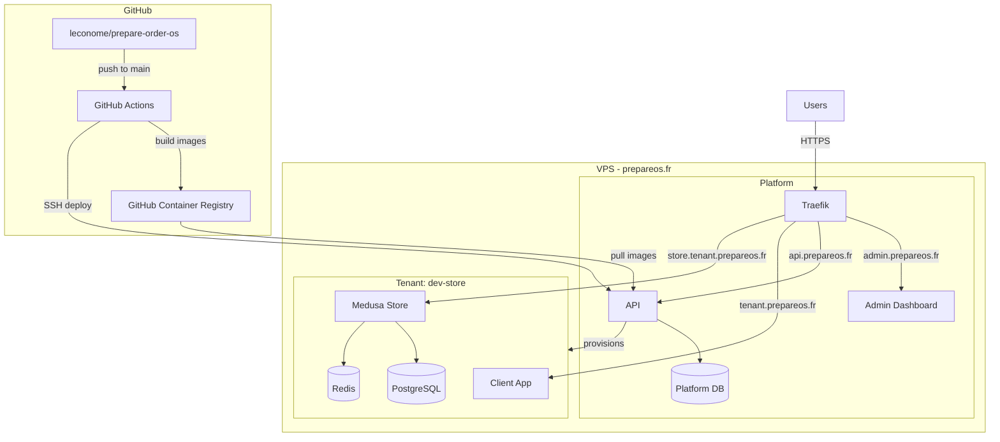

# Infrastructure & Deployment Architecture

## Overview Diagram



## URL Structure

| Component | URL Pattern | Purpose |
|-----------|-------------|---------|
| Admin Dashboard | `admin.prepareos.fr` | Manage tenants & versions |
| Platform API | `api.prepareos.fr` | Provisioning & tenant CRUD |
| Client Storefront | `{tenant}.prepareos.fr` | Customer-facing Next.js app |
| Medusa Store API | `store.{tenant}.prepareos.fr` | E-commerce backend |

## Deployment Triggers

| Trigger | Runner | Action |
|---------|--------|--------|
| Push to `main` (apps/api, apps/admin, infrastructure) | GitHub-hosted | SSH to VPS, rebuild api/admin/traefik |
| Tag `medusa-v*` | Self-hosted | Build & push Medusa image to GHCR |
| Tag `client-v*` | Self-hosted | Build & push Client image to GHCR |
| Admin Dashboard | - | Manually upgrade tenant Medusa/Client versions |

## Container Architecture

```mermaid
flowchart LR
    subgraph platform_containers[Platform Containers]
        traefik[econome-traefik]
        api[econome-api]
        admin[econome-admin]
        db[econome-platform-db]
        runner[econome-github-runner]
    end

    subgraph tenant_containers[Per-Tenant Containers]
        direction TB
        medusa[tenant_{name}_medusa]
        client[tenant_{name}_client]
        postgres[tenant_{name}_postgres]
        redis[tenant_{name}_redis]
    end

    traefik --> api
    traefik --> admin
    traefik --> medusa
    traefik --> client
    api --> db
    medusa --> postgres
    medusa --> redis
```

## Network

All containers run on the `platform_network` Docker network, allowing inter-container communication by container name.

## Secrets Required

### GitHub Actions Secrets

| Secret | Description |
|--------|-------------|
| `VPS_HOST` | VPS hostname or IP |
| `VPS_USER` | SSH username (ubuntu) |
| `VPS_SSH_KEY` | Private SSH key for VPS access |

### VPS Environment (.env.production)

| Variable | Description |
|----------|-------------|
| `DOMAIN` | Base domain (prepareos.fr) |
| `POSTGRES_PASSWORD` | Platform DB password |
| `ACME_EMAIL` | Email for Let's Encrypt |
| `API_KEY` | API authentication key |
| `DEFAULT_MEDUSA_IMAGE` | Default Medusa Docker image |
| `DEFAULT_CLIENT_IMAGE` | Default Client Docker image |
